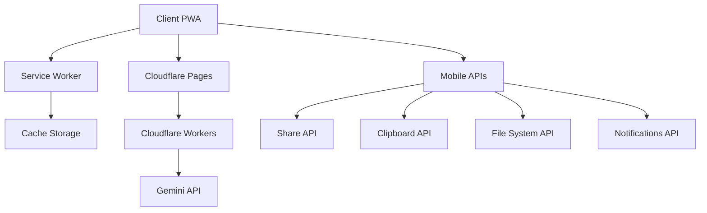

# PWA Implementation Plan: Texty - Text Enhancement Application

## 1. Project Overview

Convert the existing Chrome extension into a Progressive Web App (PWA) hosted on Cloudflare Pages, enabling broader accessibility across all devices and deeper integration with mobile features.

## 2. Technical Architecture

## 3. Implementation Steps

### Phase 1: PWA Setup
1. Add PWA Manifest
   - Create manifest.webmanifest
   - Define app icons
   - Set display properties
   - Configure start URL

2. Implement Service Worker
   - Cache static assets
   - Handle offline functionality
   - Manage background sync
   - Set up push notifications

3. Add Mobile Integration
   - Implement Share API
   - Set up Web Share Target
   - Configure File System access
   - Add Clipboard API integration

### Phase 2: Backend Migration
1. Set up Cloudflare Pages
   - Configure Git repository
   - Set up build process
   - Configure environment variables

2. Create Cloudflare Workers
   - API key management
   - Rate limiting
   - Request validation
   - Error handling

3. Database Integration (Optional)
   - User preferences
   - Enhancement history
   - Usage analytics

### Phase 3: Frontend Enhancement
1. Mobile-First UI Updates
   - Responsive design improvements
   - Touch-friendly controls
   - Mobile-optimized layout
   - Gesture support

2. New Features
   - Offline mode
   - Background processing
   - Progress indicators
   - Share sheet integration

3. Performance Optimization
   - Asset optimization
   - Caching strategies
   - Lazy loading
   - Core Web Vitals optimization

## 4. Security Considerations

1. API Security
   - Secure API key storage
   - Request authentication
   - CORS policies
   - Rate limiting

2. Data Security
   - End-to-end encryption
   - Secure storage
   - Privacy compliance
   - Data retention policies

## 5. Testing Strategy

1. PWA Testing
   - Installation flow
   - Offline functionality
   - Push notifications
   - Background sync

2. Mobile Testing
   - Cross-device testing
   - Share functionality
   - File system access
   - Clipboard operations

3. Performance Testing
   - Load times
   - Cache effectiveness
   - Memory usage
   - Battery impact

## 6. Deployment Strategy

1. Initial Setup
   - Configure Cloudflare Pages
   - Set up CI/CD pipeline
   - Configure custom domain
   - SSL setup

2. Phased Rollout
   - Beta testing
   - Gradual feature release
   - User feedback collection
   - Performance monitoring

3. Migration Plan
   - User communication
   - Data migration (if needed)
   - Legacy support
   - Rollback procedures

## 7. Timeline

- Phase 1 (PWA Setup): 2 weeks
- Phase 2 (Backend Migration): 2 weeks
- Phase 3 (Frontend Enhancement): 2 weeks
- Testing and Optimization: 1 week
- Deployment and Monitoring: 1 week

Total Timeline: 8 weeks

## 8. Success Metrics

- Installation rate
- Daily active users
- Feature usage statistics
- Performance metrics
- User satisfaction
- Error rates
- API response times

## 9. Future Enhancements

1. Advanced Features
   - Keyboard API integration
   - Custom text processors
   - AI model selection
   - Template system

2. Platform Extensions
   - Desktop app (using PWA)
   - Native mobile apps
   - Browser extensions
   - API access

Would you like to proceed with this implementation plan?